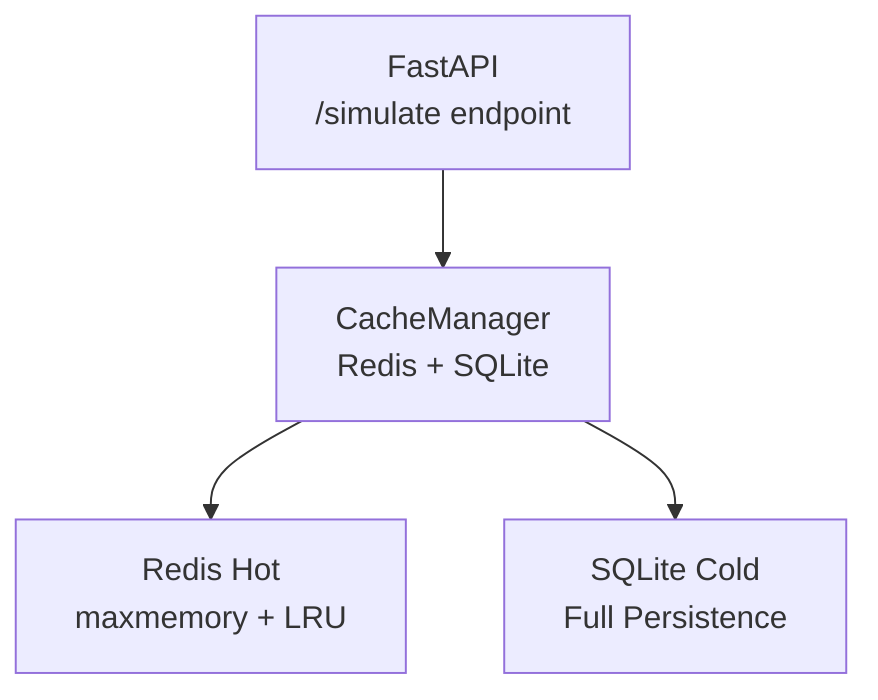

# CircuitCollector: A tool for collecting and analyzing analog circuit data

## Overview

CircuitCollector is a comprehensive tool for automated analog circuit simulation and data collection. It supports multiple circuit types (OpAmp, LDO) with flexible parameter sweeping and batch simulation capabilities.

## Tech Stack

| Category      | Technology                                                                   |
| ------------- | ---------------------------------------------------------------------------- |
| Language      |          |
| Templates     |     |
| Simulator     |  |
| Data Handling |    |
| Environment   |          |
| API           |        |
| Cache         |             |
| Database      |     |

## 📁 Project Structure

```plaintext
CircuitCollector/
├── circuits/              # Circuit definitions by type
│   ├── opamp/             # OpAmp circuits
│   │   ├── tsm/        # Two-stage Miller OTA
│   │   │   ├── netlist.j2 # TSM netlist template
│   │   │   └── tsm.jpg # TSM schematic
│   │   └── 5tota/        # 5-transistor OTA
│   │       ├── netlist.j2 # 5T OTA netlist template
│   │       └── 5tota.jpg # 5T OTA schematic
│   └── ldo/               # LDO circuits
│       └── ldo1/          # LDO instance 1
│
├── config/                # Configuration files
│   └── skywater/          # PDK-specific configs
│       └── opamp/         # OpAmp configurations
│           ├── tsm.toml
│           └── 5tota.toml
│
├── templates/             # Jinja2 templates for testbench generation
│   ├── base/              # Generic fallback templates
│   ├── opamp/             # OpAmp-specific templates
│   │   └── testbench_opamp.j2
│   └── ldo/               # LDO-specific templates
│       └── testbench_ldo.j2
│
├── spec_lib/              # Measurement templates by circuit type
│   ├── base/              # Generic measurement logic
│   │   └── header.j2
│   ├── opamp/             # OpAmp measurement templates
│   │   ├── circuit.j2     # Circuit setup
│   │   ├── dut.j2         # DUT instantiation
│   │   ├── main.j2        # Main simulation flow
│   │   └── simulation.j2  # Simulation commands
│   ├── ldo/               # LDO measurement templates
│   │   └── psrr.spice.j2
│   └── tech_lib/          # Technology library includes
│       └── skywater/
│
├── runner/                # Core simulation engine (modular design)
│   ├── simulation_runner.py      # Main simulation orchestrator
│   ├── parameter_controller.py   # Parameter management
│   ├── simulator.py              # ngspice interface
│   ├── result_parser.py          # Result extraction
│   ├── result_store.py           # CSV/database storage
│   ├── render.py                 # Template rendering
│   ├── scheduler.py              # Multi-threading support
│   └── testbench_generator/      # Testbench generation modules
│       ├── testbench_generator.py
│       ├── circuit_params_generator.py
│       ├── csv_config_generator.py
│       └── random_params_generator.py
│
├── utils/                 # Utility modules
│   ├── enums.py          # Enumeration definitions
│   ├── path.py           # Path management
│   ├── toml.py           # TOML file handling
│   └── log_checker.py    # Log error checking
│
├── test/                  # Unit tests and integration tests
│   ├── test_simulation_runner.py
│   ├── test_simulator.py
│   ├── test_render.py
│   ├── test_result_parser.py
│   └── test_log_checker.py
│
├── output/                # Simulation outputs (organized by circuit)
│   └── opamp/
│       ├── tsm/        # TSM simulation results
│       └── 5tota/        # 5T OTA simulation results
│
├── jobs/                  # Temporary simulation files
├── results/               # Structured data (CSV/JSON)
├── data/                  # Preprocessed datasets
├── log/                   # Simulation logs and error outputs
├── temp/                  # Temporary working files
│
├── simulate.py            # Command-line simulation tool
├── main.py                # Legacy main entry point
├── config.yaml            # Global configuration
├── environment.yml        # Conda/mamba environment
└── README.md              # This file
```

## Setup

### Prerequisites

- Python 3.11+
- ngspice simulator (ngspice-42 is needed for operation point analysis)
- mamba/conda package manager

### Installation

1. **Clone the repository**

```bash
git clone <repository-url>
cd CircuitCollector
```

1. **Create and activate environment**

```bash
   mamba env create -n CircuitCollector -f CircuitCollector/environment.yml
mamba activate CircuitCollector
```

1. **Install as development package**

```bash
pip install -e .
```

## Usage

### Command Line Interface

REMEMBER: before running the batch simulation, you need to delete the existing params.csv file in the circuit directory for your specific circuit.

CircuitCollector provides a simple command-line interface that automatically detects simulation strategy from configuration files.

#### Basic Usage

```bash
# Run simulation (strategy determined by config file)
python simulate.py config/skywater/opamp/tsm.toml

# Specify custom output directory
python simulate.py config/skywater/opamp/tsm.toml --output results/experiment_001
```

#### Simulation Strategies

The tool automatically detects the simulation strategy from your configuration file:

1. **Single Simulation**: When `use_params_file = false`
   - Uses parameters defined in the config file
   - Runs one simulation with fixed parameters

2. **Batch Simulation with Parameter Generation**: When `use_params_file = true` and `generate_params_file = true`
   - Automatically generates random parameter sets
   - Number of simulations controlled by `generate_num_params`

3. **Batch Simulation with Existing CSV**: When `use_params_file = true` and `generate_params_file = false`
   - Uses parameters from existing CSV file
   - CSV path specified by `params_file_path`

#### Examples

```bash
# Single simulation
python simulate.py config/skywater/opamp/tsm.toml

# Batch simulation (100 parameter sets)
# Configure in tsm.toml: generate_num_params = 100
python simulate.py config/skywater/opamp/tsm.toml --save_csv

# Custom output location
python simulate.py config/skywater/opamp/tsm.toml --output results/opamp_sweep_2024 --save_csv

# Show help
python simulate.py --help
```

#### Netlist Conversion (W-grouping)

Convert a raw opamp netlist into a Jinja2 template and generate `notice.txt` based on `w` groups:

```bash
python scripts/convert_netlist.py \
  --netlist-in CircuitCollector/circuits/opamp/HoiLee_AFFC_Pin_3/netlist.j2 \
  --netlist-out CircuitCollector/circuits/opamp/HoiLee_AFFC_Pin_3/netlist.j2 \
  --notice-out CircuitCollector/circuits/opamp/HoiLee_AFFC_Pin_3/notice.txt
```

### Generate TOML from netlist

Generate a TOML file from a netlist and notice.txt:

```bash
python scripts/generate_toml_from_netlist.py \
  --netlist CircuitCollector/circuits/opamp/HoiLee_AFFC_Pin_3/netlist.j2 \
  --notice CircuitCollector/circuits/opamp/HoiLee_AFFC_Pin_3/notice.txt \
  --out CircuitCollector/config/skywater/opamp/HoiLee_AFFC_Pin_3.toml \
  --opamp-name HoiLee_AFFC_Pin_3
```

### Configuration

Edit your circuit configuration file (e.g., `config/skywater/opamp/tsm.toml`) to control simulation behavior:

```toml
[circuit.params_file]
use_params_file = true              # Enable batch simulation
generate_params_file = true         # Generate random parameters
generate_num_params = 50            # Number of parameter sets
# params_file_path = "path/to/params.csv"  # Use existing CSV instead
```

### Output

- **Single simulation**: Results printed to console and saved to output directory
- **Batch simulation**: Results automatically saved to CSV file in output directory
- **Logs**: Detailed simulation logs saved for debugging
- **Files**: Generated netlists and intermediate files preserved

### Testing

Run the test suite to verify installation:

```bash
# Run all tests
python -m pytest test/

# Run specific test
python test/test_simulation_runner.py

# Run with verbose output
python test/test_simulation_runner.py -v
```

## Features

- ✅ **Multi-circuit support**: OpAmp, LDO, and extensible to other circuit types
- ✅ **Flexible parameter sweeping**: Random generation or CSV-based parameter sets
- ✅ **Template-based testbench generation**: Jinja2 templates for easy customization
- ✅ **Automated result extraction**: Parse simulation outputs into structured data
- ✅ **Batch processing**: Efficient handling of large parameter sweeps
- ✅ **Error handling**: Robust error detection and logging
- ✅ **CSV export**: Automatic result compilation for analysis
- ✅ **Modular design**: Easy to extend and customize

## Support

For issues and questions:

- Check the test files for usage examples
- Review configuration files in `config/` directory
- Examine log files in `log/` directory for debugging

## One More Thing

### How to setup the server

Setup the server using the following command:

```bash
nohup fastapi dev --port 8001 CircuitCollector/api/main.py > CircuitCollector/logs/nohup.out 2>&1 &
```

### How to clean up the temporary files

We using mutli-env RL to run the simulation, so we need to clean up the temporary files after the simulation is finished.

```bash
cd output && rm -rf _w0*/ _r*/ && cd ..
```

### How to stop the api

```bash
kill -9 $(lsof -ti:8001)
```

### Cache Framework Overview

The cache framework uses a two-tier architecture combining Redis (hot cache) and SQLite (cold storage) to provide high-performance caching with full data persistence.

#### Architecture



#### 1. Redis: Hot Cache

Redis serves as the hot cache, storing recently used simulation results.

**Behavior:**

- When the API writes to cache: data is written to Redis as JSON
- When Redis memory reaches `maxmemory`: automatically evicts least recently used (LRU) data using `allkeys-lru` policy
- Evicted data is safe: already persisted in SQLite
- On access to evicted key: Redis MISS → SQLite LOAD → Redis SET → becomes hot again (re-warming)
- Redis does not provide persistence (by design, SQLite handles this)

#### 2. SQLite: Cold Storage

SQLite provides full persistence storage for all simulation results.

**Behavior:**

- Every Redis write is simultaneously written to SQLite: `Redis.set` → `SQLite INSERT OR REPLACE`
- Purpose:
  - Stores all historical simulation results
  - Acts as fallback for Redis misses
  - Ensures data safety even when Redis evicts data
  - Enables data recovery after Redis restarts
  - Guarantees data never lost
- SQLite automatic compression (VACUUM) is not enabled by default and is completely user-controlled

#### 3. Write Flow (SET)

When simulation results are computed:

```python
await redis.set(key, json_value)
sqlite.insert_or_replace(key, value)
```

Both operations execute synchronously.

**Data Structure:**

```json
{
  "circuit": "config/skywater/opamp/tsm.toml",
  "params": {...},
  "specs": {...},
  "op_region": {...},
  "logs": ...
}
```

Note: The `circuit` field stores the `base_config_path` (basedir) to distinguish between different circuit types and instances.

#### 4. Read Flow (GET)

Cache lookup follows a priority chain with automatic fallback:

1. **Redis GET(key)**
   - Hit → return immediately
2. **Redis MISS:**
   - **SQLite SELECT(key)**
     - Hit → `Redis.set(key, value)` → return (re-warms cache)
     - Miss → run simulation → write to Redis + SQLite → return

**Complete fallback chain:** Redis → SQLite → Redis

#### 5. Redis Memory Control (Automatic LRU)

The system uses memory-limited Redis with automatic LRU eviction.

**Configuration:**

Via Docker CLI:

```bash
docker exec -it analog-redis redis-cli CONFIG SET maxmemory 1gb
docker exec -it analog-redis redis-cli CONFIG SET maxmemory-policy allkeys-lru
```

Or dynamically in Python:

```python
await redis.execute_command("CONFIG SET maxmemory 1gb")
await redis.execute_command("CONFIG SET maxmemory-policy allkeys-lru")
```

**Effect:**

- Redis uses at most 1GB memory
- Excess data is automatically evicted via LRU
- Evicted data is automatically re-loaded from SQLite on next access

#### 6. Key Design (Canonical Key)

To ensure consistent keys regardless of parameter order:

```python
canonical_params = json.dumps(params, sort_keys=True)
key = sha256(circuit + "|" + canonical_params)
```

Where `circuit` is the `base_config_path` (e.g., `"config/skywater/opamp/tsm.toml"`) used to distinguish different circuit types and instances.

This prevents duplicate simulations for the same parameter set and ensures different circuits with the same parameters have different cache keys.

#### 7. Concurrency Control (Distributed Lock)

To prevent multiple workers from simulating the same parameters simultaneously:

```python
redis.lock(f"lock:{key}", timeout=30, blocking_timeout=10)
```

**Flow:**

- Worker A acquires lock → executes simulation → writes to cache
- Worker B waits for lock → after simulation completes, reads from cache directly

This eliminates duplicate simulations under concurrent load.

#### 8. Restart Recovery

If Redis restarts:

- CacheManager automatically reads from SQLite (on-demand loading)
- Full preload is not required (unless desired)

**Optional startup preload:**

```python
@app.on_event("startup")
async def preload():
    rows = sqlite.get_all()
    for key, value in rows:
        await redis.set(key, value)
```

Preloading is optional and not required for normal operation.

#### 9. Error Scenarios

**Redis LRU eviction:**

- Data is safe (already in SQLite)

**Redis restart:**

- Data is safe (recovered from SQLite)

**SQLite write failure:**

- Should be logged (rare occurrence)

#### 10. Monitoring (Optional)

Cache statistics can be exposed via `/cache_stats` endpoint:

- `redis_hit`: Number of Redis cache hits
- `redis_miss`: Number of Redis cache misses
- `sqlite_hit`: Number of SQLite lookups that found data
- `sqlite_miss`: Number of SQLite lookups that missed
- `set_count`: Total number of cache writes
- `redis_memory`: Current Redis memory usage
- `redis_key_count`: Number of keys in Redis
- `evicted_keys`: Number of keys evicted by LRU

**View LRU eviction stats via Redis CLI:**

```bash
redis-cli INFO stats | grep evicted_keys
```

#### Summary

**Architecture in one sentence:**

Redis = Hot cache with memory limit + automatic LRU eviction  
SQLite = Cold storage with guaranteed data persistence  
Write: Redis + SQLite synchronous writes  
Read: Redis → SQLite fallback chain  
Concurrency: Redis distributed locks  
Key: Canonical + stable SHA256 hash  
Recovery: SQLite-based restoration  
Result: High performance, zero data loss, simple maintenance

### Check Docker container status and restart if needed

```bash
# Check Docker container status
systemctl status docker

# Check running containers
docker ps

# Check all containers
docker ps -a

# Start stopped containers
# redis
docker start analog-redis
```
